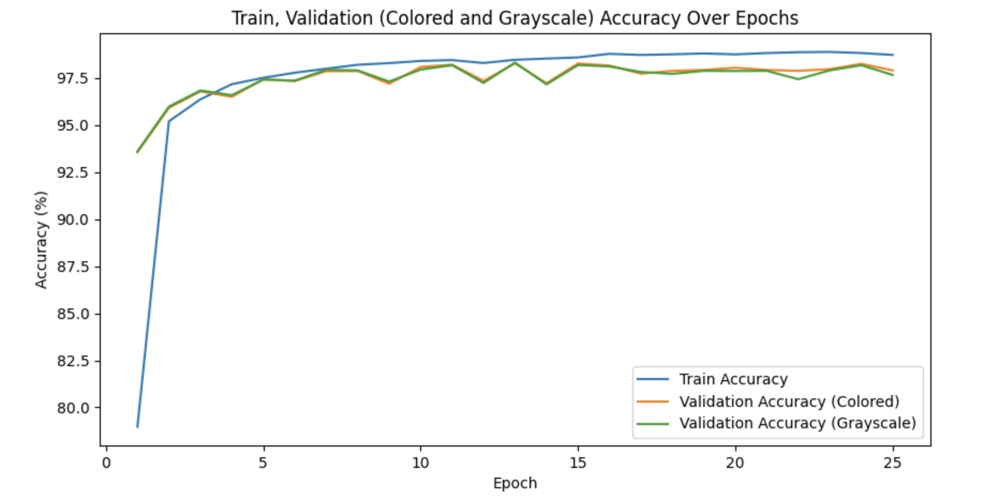
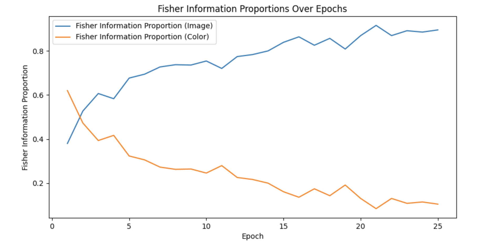
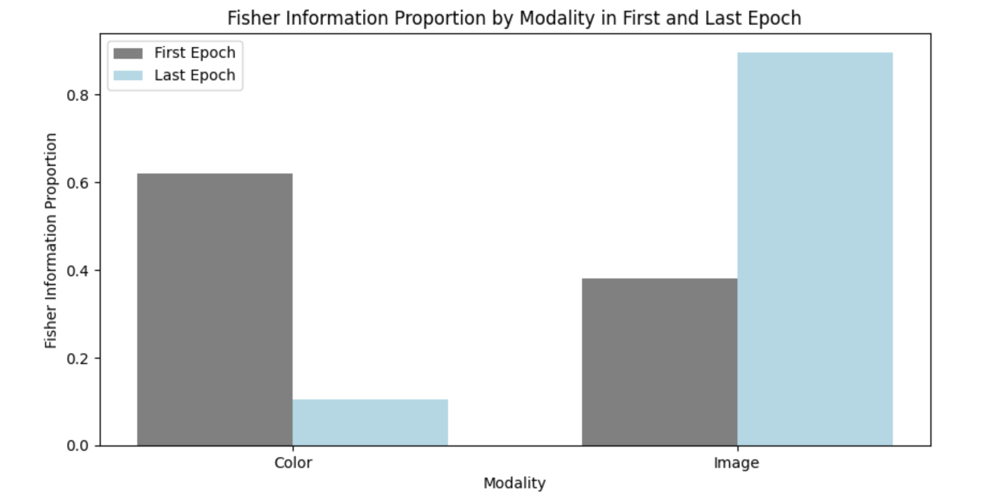

# BiasMitigation - Colored MNIST Generalization Technique

This repository contains code for training a Modified LeNet model on the Colored MNIST dataset using a custom regularization technique and measuring its generalization capabilities.

## Requirements

- Python 3.8+
- PyTorch 2.2.2
- torchvision 0.17.2
- tqdm 4.65.0
- matplotlib 3.7.4
- argparse 1.4.0

## Installation

1. Clone the repository:

```sh
git clone https://github.com/SMART-Lab-NYU/BiasMitigation.git
cd BiasMitigation

```
2. Install the required packages:

```sh
pip install -r requirements.txt


```
## Usage
To train the model and measure generalization, run:

```
python main.py

```

### Default Arguments

When running `python main.py`, the following default arguments will be used. You can modify these by providing different values when running the script.

- `--gpu`: GPU ID to use (default: `0`)
- `--data_dir`: Directory to download the MNIST dataset (default: `./data`)
- `--batch_size`: Batch size for training and evaluation (default: `128`)
- `--epochs`: Number of training epochs (default: `50`)
- `--lr`: Learning rate for the optimizer (default: `1e-2`)
- `--lambda_image`: Regularization parameter for image perturbations (default: `1e-12`)
- `--lambda_color`: Regularization parameter for color vector perturbations (default: `7e-11`)
- `--n_samples`: Number of samples for perturbation (default: `10`)
- `--norm`: Norm for regularization (default: `2.0`)
- `--optim_method`: Optimization method for regularization (default: `max_ent`)
- `--estimation`: Estimation method for regularization (default: `var`)
- `--knn_value`: K-NN value for perturbation tensor (default: `219`)
- `--std`: Standard deviation for color perturbation (default: `0.1`)
- `--patience`: Patience for early stopping (default: `10`)

Example usage with custom arguments:

```bash
python main.py --gpu 1 --epochs 100 --lr 0.001
```

## Dataset Samples
In the image below, you will find samples from the training dataset (colored), the colored test dataset, and the grayscale dataset.


## Results
Here, we show the sample results on a test run. We use the default hyperparameters and the model converges in 25 epochs. The final results were as follows:

- **Test Accuracy on Colored MNIST at convergence:** 98.58%
- **Max Accuracy Observed on Grayscale MNIST:** 98.50%
- **Accuracy Observed on Grayscale MNIST at Convergence:** 98.50%

 
The saved model is stored in results/test_run.pth. 

### Accuracy and Fisher Information Proportions

- **Train, Validation (Colored and Grayscale) Accuracy Over Epochs:**

As seen in the plot below, the model converges in 25 epochs as the training loss stabilizes. We can see the model maintains high accuracies on the validation sets at convergence.
 
  

- **Fisher Information Proportions Over Epochs:**

We see below that while the model relies more heavily on color information initially, our regularization forces it to consider image information more strongly.

  

- **Fisher Information Proportion by Modality in First and Last Epoch:**

We can see that the model learns to maximize the functional fisher information for the modality that contributes more strongly to classification (i.e. image modality).

  

## License
This project is licensed under the MIT License - see the LICENSE file for details.
